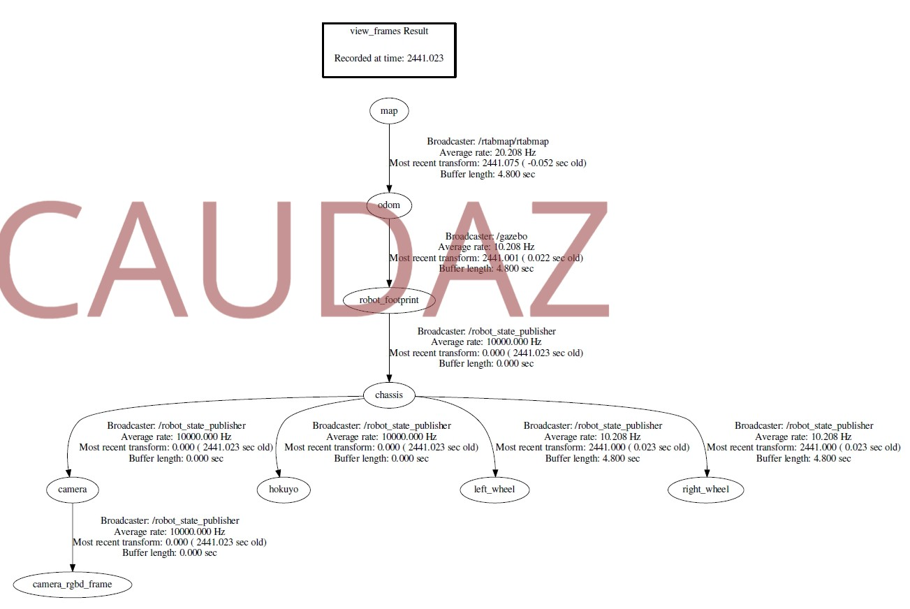

# Robotics Nanodegree #

## Term2 – Project3: ROS Map My World Robot using RTAB-Map  ##


## INSTALLATING ROS and RTAB-Map ##

1. Install ROS:

```
sudo sh -c 'echo "deb http://packages.ros.org/ros/ubuntu $(lsb_release -sc) main" > /etc/apt/sources.list.d/ros-latest.list' && sudo apt-key adv --keyserver hkp://ha.pool.sks-keyservers.net:80 --recv-key 421C365BD9FF1F717815A3895523BAEEB01FA116 && sudo apt-get update && sudo apt-get install ros-kinetic-desktop-full && sudo rosdep init && rosdep update && echo "source /opt/ros/kinetic/setup.bash" >> ~/.bashrc && source ~/.bashrc
```
Note: Skip this step if ROS is already installed.

2. Install dependencies: 
```
sudo apt-get install ros-kinetic-rtabmap ros-kinetic-rtabmap-ros && sudo apt-get remove ros-kinetic-rtabmap ros-kinetic-rtabmap-ros
```

3. Install RTAB-Map: 
```
cd ~ && git clone https://github.com/introlab/rtabmap.git rtabmap && cd rtabmap/build && cmake .. && make && sudo make install
```

4. Create .gazebo folder: Open gazebo and then close it.

5. Add model collision adjustments: 
```
curl -L https://s3-us-west-1.amazonaws.com/udacity-robotics/Term+2+Resources/P3+Resources/models.tar.gz | tar zx -C ~/.gazebo/
```

6. For issues refer to:

https://classroom.udacity.com/nanodegrees/nd209/parts/dad7b7cc-9cce-4be4-876e-30935216c8fa/modules/aec2781f-e368-4e1e-9aef-d46aeee55354/lessons/0f504827-ab9c-4280-913f-413e4df602be/concepts/d83d9bd1-d7ff-4a61-85ce-bde660c71c2d
https://classroom.udacity.com/nanodegrees/nd209/parts/dad7b7cc-9cce-4be4-876e-30935216c8fa/modules/aec2781f-e368-4e1e-9aef-d46aeee55354/lessons/0f504827-ab9c-4280-913f-413e4df602be/concepts/bb19e9b7-9314-47c7-9afc-e23ce2811f7e

7- RTAB
```
sudo apt-get install ros-kinetic-rtabmap-ros
```

## RUNNING ROS ##

0) Create a Catkin workspace and download files

```
mkdir -p ~/catkin_ws/src

cd ~/catkin_ws/src

catkin_init_workspace

git clone https://github.com/caudaz/robotND2-proj3

cd ~/catkin_ws

catkin_make

```

1) Launch the gazebo world and your robot.
```
cd catkin_ws
source devel/setup.bash
roslaunch slam_project world.launch
```

2) Launch your teleop node.
```
cd catkin_ws
source devel/setup.bash
roslaunch slam_project teleop.launch
```

3) Launch your mapping node.
```
cd catkin_ws
source devel/setup.bash
roslaunch slam_project mapping.launch
```

4) Launch Rviz.
```
cd catkin_ws
source devel/setup.bash
roslaunch slam_project rviz.launch
```

5) Grab the rtabmap.db file from the ~/.ros/ directory and visualize it using the RTAB Map Database Viewer


## ABSTRACT ##

SLAM or Simultaneous Localization and Mapping is a hot topic in the field of robotics. Real Time Appearance 
Based Mapping (RTAB-Map) is a SLAM algorithm that can map unknown environments while localization is also taking place. This project was built starting with the previous project (particle filters in ROS). This project was able to successfully map a small apartment like environment. 

## INTRO ##

In the real world, robots have to localize and map their environments because of the unknown nautre of them.

SLAM has:

* a continous part: robot moving poses and measurements

* a discrete part: deciding if the robot has been on that same place (corresponding problem)

The main 2 SLAM algorithms used are: FastSLAM and GraphSLAM.


## BACKGROUND ##

GraphSLAM is optimization at the core. It minimizes the error present in the constraint of the graph, applying the maximum likelihood estimation principle (MLE). It will construct a graph, define the contraints, and solve the system. It will use:

* odometer

* RGB-D camera (such as Kinect)

* laser rangefinder

On the back end it will perform loop closure detection, graph optimization, and 2D/3D map generation.

An example of loop closure is shown below (credit UDACITY):


RTAB-Map will result in database map files that can be read later for visualization.


## SCENE AND ROBOT CONFIGURATION ##

The scene is comprised of a small apartment 3D geometry (kitchen_dining.world).

The robot is comprised of:

* odometer

* RGBD camera

For this particular model the laser sensor is simulated using the RGBD camera that converts the depth to laser like readings (credit UDACITY):


## RESULTS ##

While running ROS, the following process was used to arrive at the final 2D and 3D maps:

1) rosrun tf view_frames

Creates a tree representation of the frames/links and how they physically attach.



2) rqt_graph

Visualizes the ROS graph with nodes and how messages are passed.


3) roswtf

Examines and analyzes the rqt_graph and checks for issues or errors.


4) rqt_console

Aggregates all ROS errors based on severity and each message includes various info.


5) rqt_image_view

To visualize live streaming images from camera and depth sensors.


6) rtabmap-databaseViewer ~/.ros/rtabmap.db

Allows checking for loop closures, generate 3D maps for viewing, images, 2d map zones. Pink spheres are loop closures created by 2 images that have features in common.


The final maps in 2D and 3D are very recognizable:


## DISCUSSION ##

The SLAM algorithm utilized is very computationally intensive. However, for an enviroment such as the kitchen world, using an Intel i7 processor, there were no delays in the processing of the loop closures and creating the maps.

The point of view of the robot sensors (RGBD  and Lidar) will determine how the maps look like. 


## FUTURE WORK ##

* This project could be use to create a Robot to assist blind people. The robot would be deployed before hand to a building location where a blind person is gonna be working at and would map the environment for that person. Later that person can use a sensor that will guide him/her to the destination in the building

* Perform Localization

* Utilize visual odometry 

* Obstacle detection

* WiFi Signal Strength Mapping

* Finding objects in 2D and 3D

* Multisession mapping


## APPENDIX ##

UDACITY provided files:
https://s3-us-west-1.amazonaws.com/udacity-robotics/Term+2+Resources/P3+Resources/Student+Project+Materials.zip
kitchen_dining.world -> worlds\
robot_slam.rviz      -> launch\config\
rtab_run             -> src\
rviz.launch          -> launch\
teleop               -> src\


